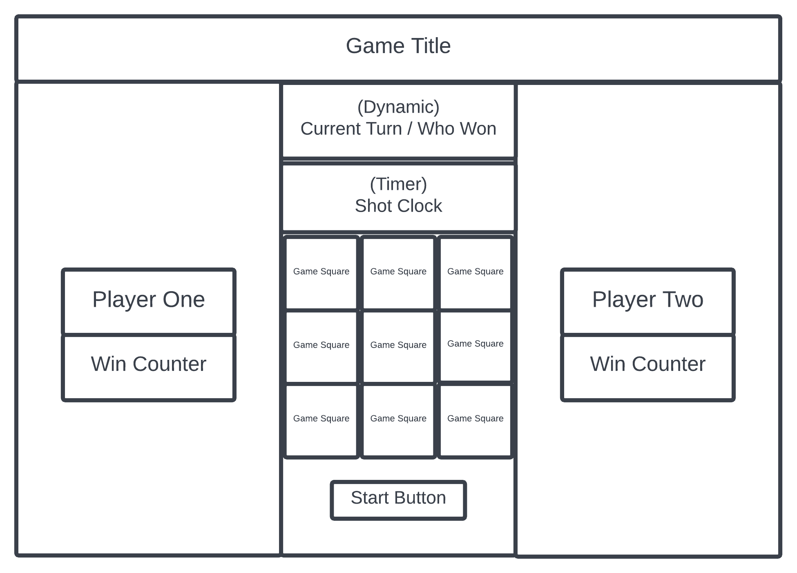
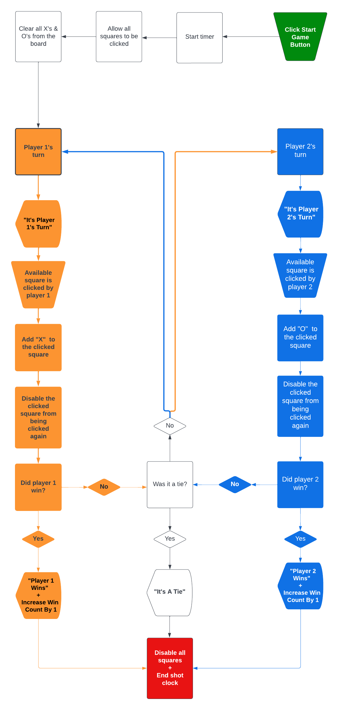

# Basketball Tic Tac Toe
<a href="https://marcusadams1220.github.io/tic-tac-toe/">Click Here To Play The Game</a>
# Summary Of Project

I added a basketball twist to the classic game of Tic Tac Toe. 

In basketball, there's a 24 second shot-clock & once you receive the ball you have to shoot before the clock expires. 

So in this version of Tic Tac Toe, I added a 5 second shot-clock to speed up the pace of the game.

I also inlcuded a win counter so each player can track how many times they've won over mutliple games.

# Approach I Took To Solve The Problem

## HTML Wireframe
  

## Flowchart
  

# Code I'm Proud Of
The code below creates an array of the game squares & adds 2 'click' event listeners to each square by looping through the array:

`var allSquares = Array.from(document.querySelectorAll('.game-square'))`

`for (var i = 0; i < allSquares.length; i++) {`

`allSquares[i].addEventListener('click', handleClick)`

`allSquares[i].addEventListener('click', resetTimer)`

`}`

# Lessons I Learnt
While learning how to write the code above, I also discovered a more efficient way to achieve the same outcome using the forEach method.

`allSquares.forEach(square => square.addEventListener('click', resetTimer))`
